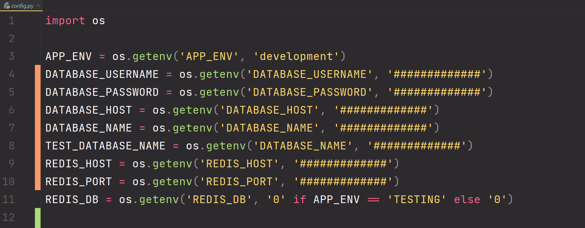
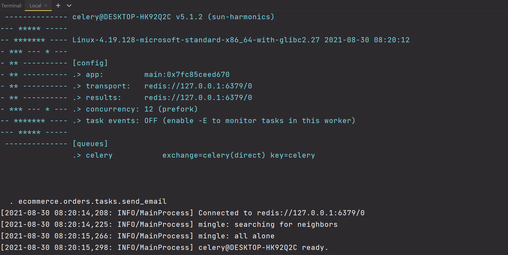

## Prerequisites 

Before starting up this project, make sure you have an AWS account and 
PyCharm installed in your machine.

### Software Installation

- [x] [AWS Command Line Interface](https://aws.amazon.com/cli/) - The AWS Command Line Interface (CLI) is a unified tool to manage your AWS services.


- [x] [eksctl](https://eksctl.io/) - The official CLI for Amazon EKS


- [x] [Docker](https://www.docker.com/) - Docker helps developers bring their ideas to life by conquering the complexity of app development.


- [x] [Kubernetes](https://kubernetes.io/) - also known as K8s, is an 
 open-source system for automating deployment, scaling, and management of containerized applications.


- [x] [Helm](https://helm.sh/) - The package manager for Kubernetes. Helm helps you manage 
Kubernetes applications — Helm Charts help you define, install, and upgrade even the most complex Kubernetes application.


- [x] [PostgreSQL](https://www.postgresql.org/) - The World's Most Advanced Open Source Relational Database


- [x] [Redis](https://redis.io/) - open source (BSD licensed), in-memory data structure store, used as a database, cache, and message broker


- [x] [NICE DCV](https://www.nice-dcv.com/) (Optional) - Deliver high-performance remote desktop and application streaming. If 
you are interested to run your workload directly in AWS.

## System Dependencies

- Make sure your system is up-to-date.
- Run the below command to install python system 
dependencies along-with postgres driver.

```bash

$ sudo apt-get install libpq-dev python-dev libssl-dev

```


## Python Dependencies

- Installing Python Packages

```bash

$ pip install -r requirements.txt

```


- Running Uvicorn Server

```bash

$ uvicorn main:app --reload

```

## Environment

Make sure to update the environment variables in **ecommerce/config.py**, before starting up the project.





## Celery

Make sure before starting up Celery, redis is up and running.

Command to start celery worker :

```bash
$ celery -A main.celery worker -l info
```
or with execution pool
```bash
$ celery -A main.celery worker -l info --pool=prefork
```



## Testing

Before proceeding make sure you have created a test database in Postgres.


